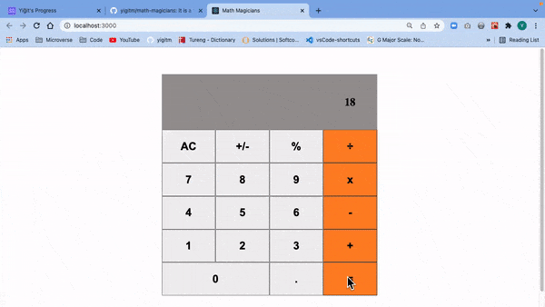

# Math Magicians

## About

> It is a Single Page App (SPA) that allows users to make simple calculations & read a random math-related quote.



This project consist of learning; class and functional component syntax with testing practices in React.

## Built With

- Html, CSS, Javascript
- React
- Jest

## Live Demo

[Live Demo Link](https://livedemo.com)

## Getting Started

### Prerequisites

If you are not familiar to use terminal, please check this [article](https://www.theodinproject.com/courses/web-development-101/lessons/command-line-basics-web-development-101)

### Setup

Open your terminal and run the following commands on your terminal.

Make sure 'Javascript' is not blocked in your browser.

### Install

To get a local copy of the repository, run the following commands on your terminal.

```
cd <your_desktop>
```

```
git clone git@github.com:yigitm/math-magicians.git
```

```
cd math-magicians
```

### Usage

To install the necessary Javascript packages to your project, run below commands.

```
npm install
```

### Run tests

### Deployment

## Authors

👤 **Yigit Mersin**

- GitHub: [@github](https://github.com/ygtmrsn)
- LinkedIn: [@linkedIn](linkedin.com/in/yigitmersin)
- Twitter: [@twitter](https://twitter.com/ygtmrsn)

## 🤝 Contributing

Contributions, issues, and feature requests are welcome!

Feel free to check the [issues page](https://github.com/yigitm/math-magicians/issues).

## Show your support

Give a ⭐️ if you like this project!

## Acknowledgments

- Microverse
- Free Code Camp
- Open Source

## 📝 License

This project is [MIT](./MIT.md) licensed.
